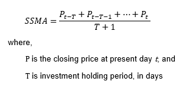
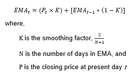
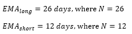
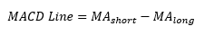
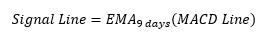

# MACD Trend Reversal Trading System

This is a simple [moving average convergence/divergence (MACD)](https://www.investopedia.com/terms/m/macd.asp) script that allows investors to
1. Identify the market entry points for buying or selling 
2. Compare their profit or losses from buying and selling based on the MACD signals to a simple buy-hold-sell position
based on historical financial data.

## Background
### Two Computation Methods
One of the two methods can be selected to compute the MACD histogram.
|Methods|Formula|Assumptions|
|-|-|-|
|Simple Moving Average (SMA)|||
|Exponential Moving Average (EMA)|||

### MACD Line and Implications
The MACD line is calculated as follow:

which is used to calculate the signal line:

The signal line serves as a trigger for buy and sell signals. When the signal line crosses
- `Over the MACD line`, a buy signal will be indicated.
- `Under the MACD line`, a sell signal will be indicated.

### Historical Financial Data
3 stock exchanges' historical financial datas are provided for computation.
1. CAC40 for the period of 1998 to 2021
2. FTSE100 for the period of 1998 to 2021, and
3. SPY for the period of 2016 to 2021

## Demonstration
### Simple Moving Average

### Exponential Moving Average
